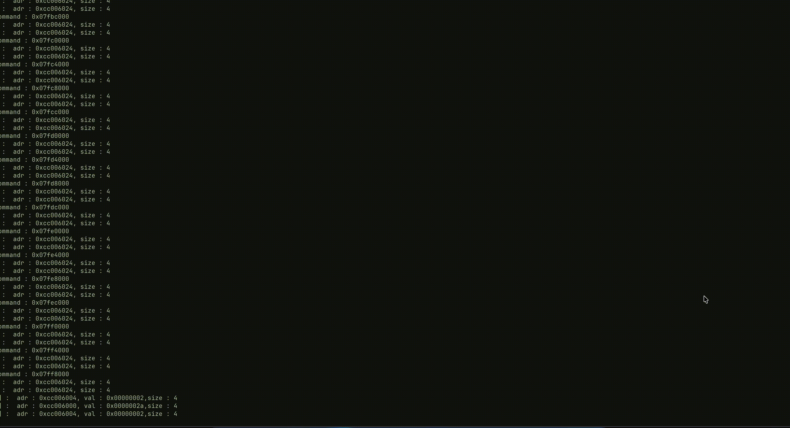

Gamecube emulator with dynamic recompilation(qemu arch)

TODO RENDER:
  - [ ] transformation
      - [ ] frac in pos
  - [ ] Texture mapping 
  - [ ] color channels 
  - [ ] effects
  - [ ] post processing 

TODO Optimization
 - [ ] tb-chainging
 - [ ] global memory maanager (allocate in bigger chunks)

 - [x] use another thread for the command processor

