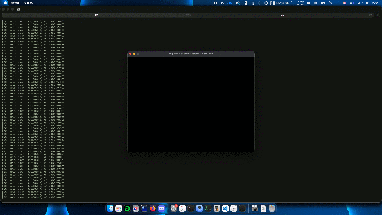

#GameCube emulator for ARM64 architecture with OpenGL renderer

**Launches a couple of games at ~20% of the original CPU speed**

TODO RENDER:
  - [x] transformation
      - [x] frac in pos
  - [x] Texture mapping 
  - [x] color channels 
  - [x] effects
  - [x] post processing 

TODO Optimization
 - [ ] tb-chainging
 - [ ] global memory maanager (allocate in bigger chunks)
 - [ ] cpu paging

